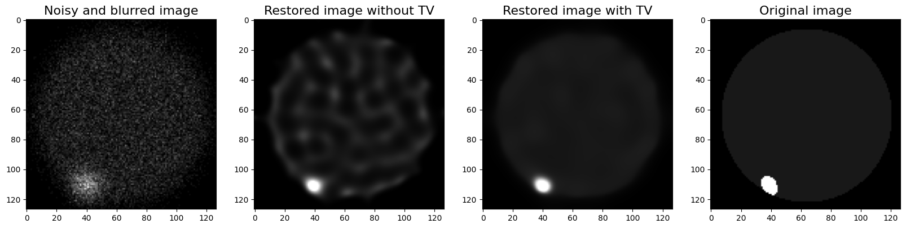
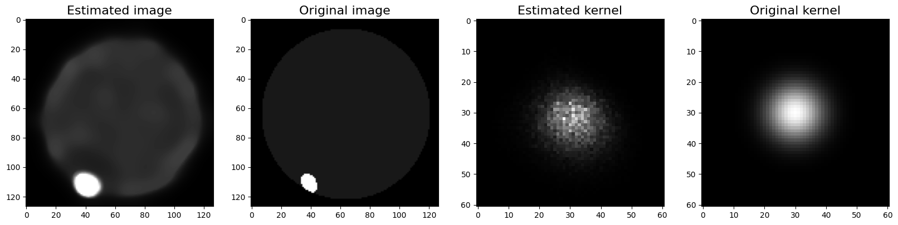
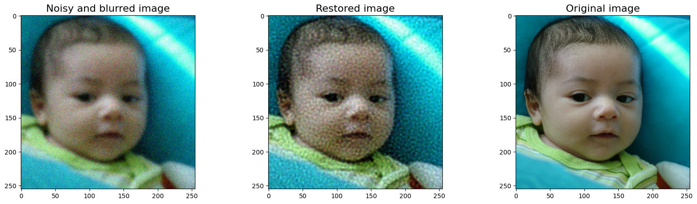

# Richardson-Lucy deconvolution algorithm with PyTorch

This repository provides a GPU implementation of the Richardson-Lucy deconvolution algorithm leveraging the computational capabilities of PyTorch. The Richardson-Lucy algorithm is widely used for image deblurring and restoration, particularly in the context of microscopy and astronomical imaging.

## Examples


*Non-blind deconvolution with a greyscale image*


*Blind deconvolution with a greyscale image*


*Non-blind deconvolution with a color image*

## Installation

### Prerequisites

- Anaconda or Miniconda installed on your system

### Environment Setup

You can create the conda environment using the ``environment.yaml`` file.

1. Clone this repository to your local machine.
2. Navigate to the repository's root directory in your terminal.
3. Create a Conda environment using the provided environment.yaml file:

```shell
conda env create -f environment.yaml
```

## Usage

The core functionality is provided by the ``richardson_lucy`` function. To use it, import the function from ``richardson_lucy.py`` and pass your image along with the point spread function (PSF) and other parameters as needed.

```python
from richardson_lucy import richardson_lucy

deconvolved_image = richardson_lucy(y, x, k, steps=20, tv=False)
```

You can also find an usage example in the ``greyscale.ipynb`` and ``color.ipynb`` jupyter notebooks.
To test the algorithm, several types of blur are implemented such as Gaussian blur and motion blur (thanks to the code from [this repository](https://github.com/LeviBorodenko/motionblur)).
TV regularization is also implemented using a torch implementation of Chambolle-Pock denoising.
Color images are only partially supported, for instance TV regularization does not work yet.

## License

This project is licensed under the MIT License - see the LICENSE file for details.